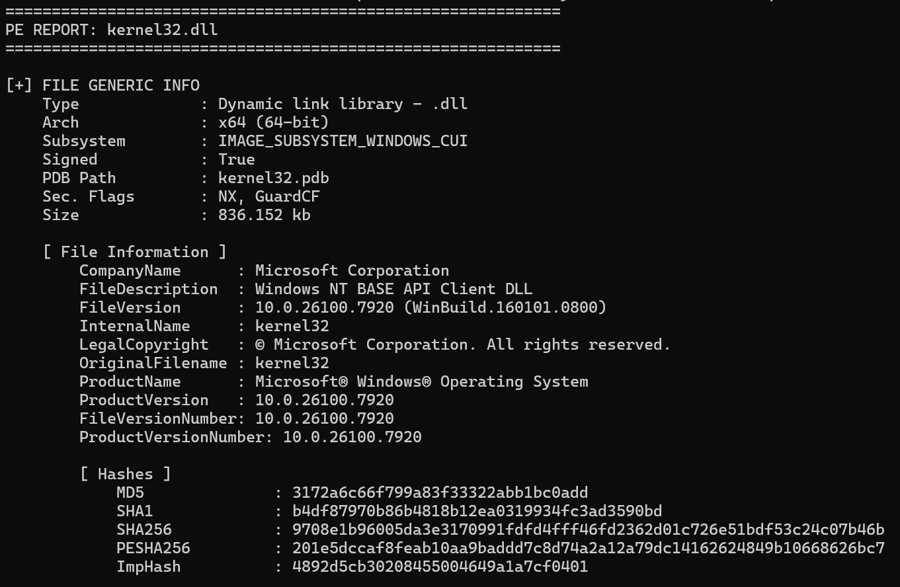
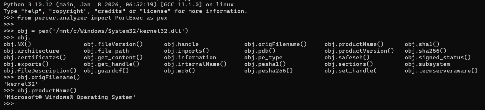

# Percer


**Percer** is a Portable Executable (PE) file format dissection utility and library which I use to quickly get information about Windows executables. Percer functions as both a command-line interface (CLI) utility and a library, allowing researchers to extract key information from PE files (metadata, sections, imports/exports, certificates). It comes with a VirusTotal search functionality which enables the user to run custom queries and download files.

## 🌟 Features
- Dual Mode: Operate as a standalone tool or integrate as a library.

- PE Analysis: Parse Imports, Exports, Sections, and Certificate information (wraps around Python pefile).

- VirusTotal Integration: Query file hashes and download samples to files / byte streams.

- Flexible Inputs: Analyze local files by path or remote samples by hash.


## 🛠 Installation
Install Percer from the source code.

```bash
# Clone the repo
git clone https://github.com/lem0nSec/Percer.git

# Navigate to the directory
cd Percer

# Install dependencies and package
pip3 install .
```

## 📖 Configuration
Percer VirusTotal searching functionality requires a valid API key which has to be set as environment variable.

* Linux
```bash
export VT_API_KEY='API key goes here'
```

* Windows (cmd)
```batch
set VT_API_KEY=API_key_goes_here
```


## 🚀 CLI Usage
Percer provides a simple command-line interface.

**Help Menu**
```
C:\>percer --help
usage: percer <PE file> [-h] (-F FILE | -H HASH) [-a] [-e] [-i] [-s] [-c] [-q]

options:
  -h, --help            show this help message and exit
  -F FILE, --file FILE  Target file
  -H HASH, --hash HASH  Target hash (VirusTotal Search requires VT_API_KEY)
  -a, --all             Show all info
  -e, --exports         List exports
  -i, --imports         List imports
  -s, --sections        List sections
  -c, --certificates    Get certificates information
  -q, --quiet           Do not print the banner
```

**Examples**

**Analyze a local file**
```batch
percer -F samples.exe
```

**Query hash on VirusTotal**
```batch
percer -H <sha256/sha1/md5/Authentihash>
```

**CLI output preview** 



## 📦 Library Usage
Percer can be imported into Python projects.

```python
from percer.analyzer import PEAnalyzer
from percer.virustotal import VirusTotal

with open('hashes.txt', 'r') as f:
  hashes = [line.strip() for line in f]

with VirusTotal() as scanner:
  for input_hash in hashes:
    try:
      content = scanner.get_content(scanner.resolve_hash(input_hash))
      pex_object = PEAnalyzer.from_bytes(content)
      print(f"Product Name of {input_hash} is {pex_object.product_name}")
    except Exception as E:
      print(E)
      pass
```

**Library output preview**


