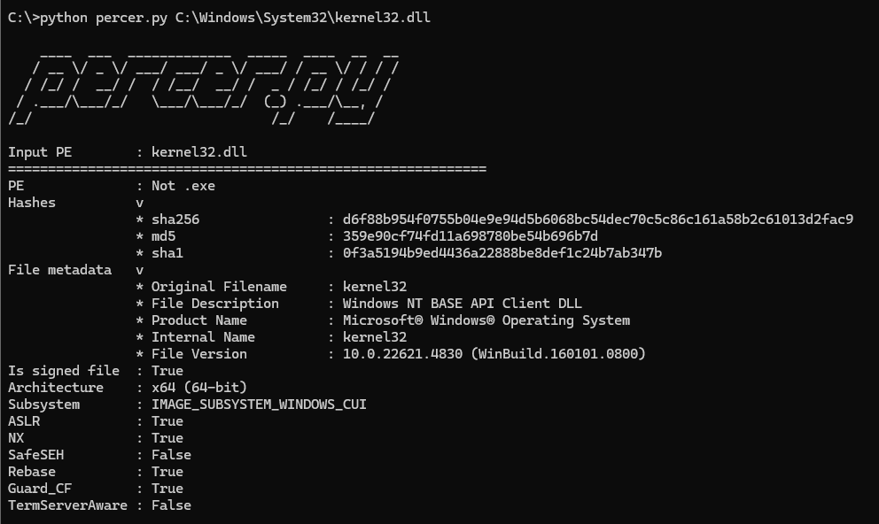

# Percer.py

**Percer.py** is a Portable Executable (PE) file format utility which I use to quickly get information about a PE file. The `--help` command displays the type of information the tool can retrieve.
```
C:\>python percer.py --help
usage: percer.py [-h] [-a] [-e] [-i] [-s] [-c] PE

positional arguments:
  PE

options:
  -h, --help          show this help message and exit
  -a, --all           Show all info
  -e, --exports       List exports
  -i, --imports       List imports
  -s, --sections      List sections
  -c, --certificates  Get certificates information

Example (no options): python percer.py C:\Windows\System32\kernel32.dll
```


Below is an example of Percer being run on Kernel32.dll.

